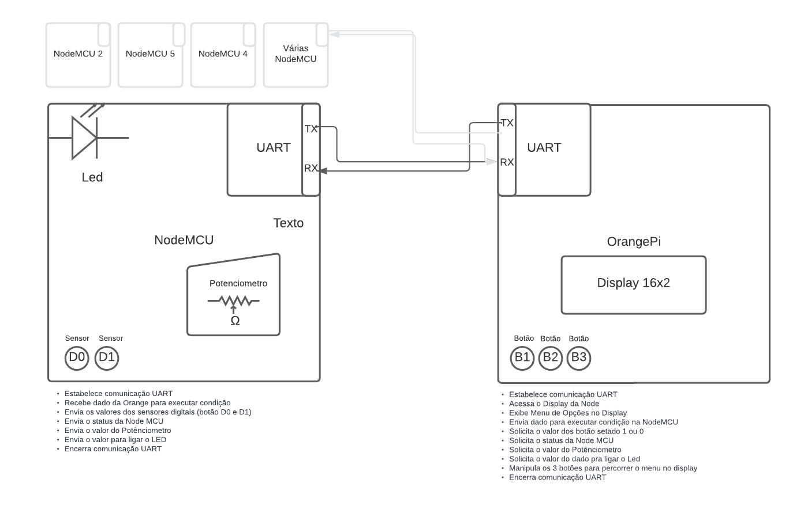
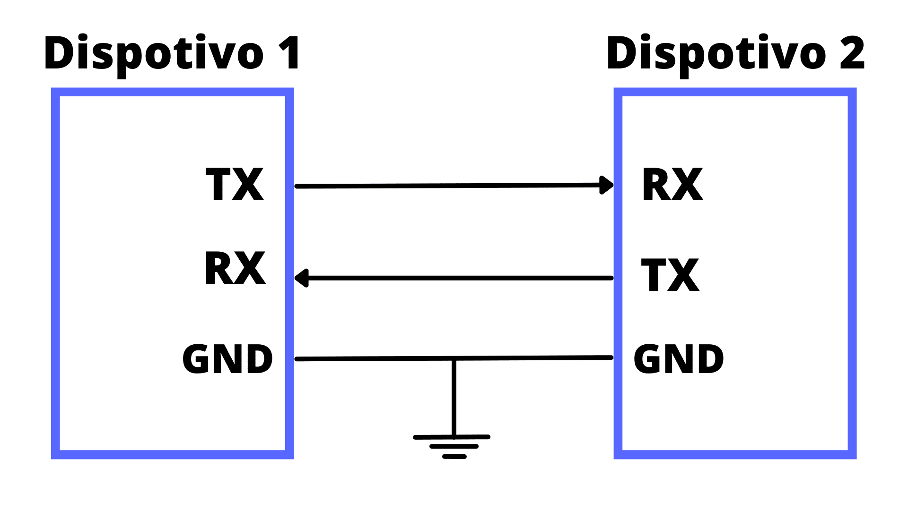

# Problema #2 – Interfaces de E/S


 📌 PBL 2 | Sistemas Digitais | Univerdade Estadual de Feira de Santana 

## 🚀 introdução

Foi solicitado um projeto de sensor analógico/digital em microcontrolador utilizando comunicação serial UART.

Consulte **[Implantação](#-implanta%C3%A7%C3%A3o)** para saber como implantar o projeto.

### 📋 Requisitos
O sistema a ser implementado no SBC deverá atender aos seguintes requisitos:
```
- O código deverá ser escrito em linguagem C; 
- Capacidade de interligação com até 32 unidades de sensoriamento;
- Mecanismo de controle de status de funcionamento das unidades;
- Apenas o SBC será capaz de iniciar uma comunicação.
```
O protótipo a ser implementado na NodeMCU deverá atender às seguintes restrições:
```
- O código deverá ser escrito em linguagem C;
- Deverá ser capaz de ler e interpretar comandos oriundos do SBC.
```
Além disso:
```
- Os comandos serão compostos por palavras de 8 bits;
- A informação medida deve ter a maior precisão possível;
- As requisições do SBC podem ser direcionadas para uma unidade específica ou a todas;
- As solicitações e as respostas deverão ser exibidas no display LCD.

```
### 📋 Recursos Utilizados

[Solicitação do Projeto](https://github.com/Dermeval/Interfaces_NodeMCU_OrangiPi_Display16x2_PBL2_SD/blob/main/Recursos/Solicita%C3%A7%C3%A3o%20do%20Projeto%20Probl2.pdf "Solicitação do Projeto")
[DataSheet do Orangi Pi PC Plus](https://github.com/Dermeval/Interfaces_NodeMCU_OrangiPi_Display16x2_PBL2_SD/blob/main/Recursos/DataSheet%20do%20ORANGE%20PI.pdf "DataSheet do Orangi Pi PC Plus")
[DataSheet do LCD](https://github.com/Dermeval/Interfaces_NodeMCU_OrangiPi_Display16x2_PBL2_SD/blob/main/Recursos/DataSheet%20do%20LCD.pdf "DataSheet do LCD")
[DataSheet do NodeMCU Esp8266EX](https://github.com/Dermeval/Interfaces_NodeMCU_OrangiPi_Display16x2_PBL2_SD/blob/main/Recursos/DataSheet%20Esp8266EX%20Node%20MCU.pdf "DataSheet do NodeMCU")

### 🔧 Perifêricos Necessários
```
1 Protoboard
1 Placa Orange Pi PC PLUS:
	1 Display LCD 16x2
	3 Botões
1 Placa NodeMCU
	2 Sensores (Botões)
	1 Led
	1 Potênciometro
1 Jumper para ligar a GPIO na Protoboard
```
### 🔧 Instalação

É necessário ter a [biblioteca WiringPi](http://wiringpi.com/download-and-install/ "biblioteca WiringiPi") devidamente instalada na sua Orange Pi.
Foi utilizada a [IDE Sublime txt](https://www.sublimetext.com/3 "IDE Sublime txt") para programar a OrangePi PC Plus.
Foi utilizada a [IDE Arduíno](https://www.arduino.cc/en/software "IDE Arduíno") para programar a Node MCU.

## ⚙️ Metodologia

O código foi desenvolvido na **linguagem C** e permite a placa **Orange Pi** se comunicar através de uma comunicação serial **UART** com a placa **Node MCU**, onde é possível que a nossa SBC **Orange Pi** solicite para a **Node** o envio de dados do dois sensores digitais e um dado analógico medido por um potênciometro e exibir no **display 16x2** da **Orange** todas as informações, organizadas por um menu, além de também poder ligar o **LED da Node**.

Para entender melhor a relação entre as entidades, foi desenvolvido o seguinte diagrama:



Para que toda essa comunicação fosse feita, foi necessário criar uam variável chamada 'dado' para receber determinados valores, ele ia até a NodeMC através de uma comunicação serial UART ele ia até a NodeMCU carregando uma espécie de chave que era responsável por manipular a condição dos if e else presentes na Node e enviar o dado solicitado.

 ```
254 -> Exibe:  D0
255 -> Exibe:  D1
155 -> Acende: Led
100 -> Exibe:  Analógico
```
A Uart tem três diretrizes S0, S1 e S3, nesse projeto definimos a porta serial uart como sendo a S3

``` #define PORTA_SERIAL_UART "/dev/ttyS3" ```

Foi utilizado as seguintes  variaveis globais:


| Variável  |  Descrição |
| ------------ | ------------ |
| lcd  |  Variável para armazenar o identificador do display LCD. |
|  uartfd | Variável para armazenar o identificador da porta serial UART |
| dadoRecebido   | Variável para armazenar o dado recebido via comunicação serial.|
| dado  | Variável para armazenar o dado a ser enviado via comunicação serial.  |
|  valorAnalogico |  Variável para armazenar o valor analógico lido do sensor.  |
| d[4]  |  Vetor de caracteres para armazenar os dados recebidos via comunicação serial. |

O valor do dado analógico teve que ser dividido em partes para ser enviado da Node pra a Orange, pois esse dado é muito grande para ser mandado tudo de uma vez, sendo assim, foi salvo 8 bits em uma variável, em seguida movemos 8 para direita e salvamos novamente, garantindo que todos possam ser enviados.

Já no lado da Orange, pra que ele possa ser exibido foi usado deslocamento lógico à esquerda, uma operação bit a bit que desloca todos os bits de um valor para a esquerda, colocando esse calor já somado em 'valor Analógico'.

`valorAnalogico = (d[2] << 16) + (d[1] << 8) + d[0]; 
`

Na operação de deslocamento lógico à esquerda, os bits são deslocados para a esquerda e zeros são inseridos nos bits menos significativos. O bit mais à esquerda é descartado, e um novo bit zero é colocado no bit mais à direita.

Por exemplo, vamos considerar o número binário de 8 bits 10100100 (164 em decimal). Se aplicarmos um deslocamento lógico à esquerda de 2 posições, teremos:

10100100 << 2

Resultado: 10010000

Como resultado, obtivemos o número binário 10010000 (144 em decimal), que é equivalente a multiplicar o número original por 2 elevado a 2 (ou seja, multiplicar por 4).

Em linguagens de programação, o operador de deslocamento lógico à esquerda geralmente é representado por <<. Por exemplo, em C, podemos usar o operador << da seguinte como mostrado na linha de código acima.

Para fazer o menu foi usado  "enum" que é um conjunto de valores inteiros representados por identificadores. Dentro desses menus são chamadas as funções para apresentar os valores dos dados lidos.

```enum OpcaoMenu { SelecionarNode, DadosAnalogicos, DadosDigitais, LigarLed };```

## 📄 Comunicação UART



A maioria dos circuitos de comunicação serial utiliza um transceptor conhecido como UART (Universal Asynchronous Receiver/Transmitter)[1]
O termo universal refere-se ao fato do formato do dado e velocidade serem configuráveis. Os níveis elétricos são delegados a circuitos especiais externos e não fazem parte da especificação da UART. 

Na interface de comunicação serial, somente um bit de informação é transmitido/recebido por vez. Como os dados geralmente são processados em paralelo (por um microprocessador, por exemplo), há a necessidade de convertê-los em uma sequência de bits.

## 📄 SBC - Orange Pi PC Plus


A **Orange Pi PC Plus** [2] é uma placa de computador de placa única (SBC) desenvolvida pela Xunlong Software, baseada na arquitetura ARM. Ela é projetada como uma alternativa de baixo custo para outras placas populares, como a Raspberry Pi.

A Orange Pi PC Plus possui um processador quad-core Allwinner H3, com núcleos Cortex-A7, operando a uma frequência de até 1,6 GHz.

## 📄 NodeMCU ESP8266EX


O **NodeMCU ESP8266EX** [3] é uma placa de desenvolvimento baseada no chip ESP8266EX da Espressif Systems. Ele oferece conectividade Wi-Fi e tem um microcontrolador integrado que pode ser programado usando a linguagem Lua, por exemplo. É uma escolha popular para projetos de IoT e automação residencial.

## 📄 Display LCD 16X2


O **Display LCD 16x2** é um dispositivo de saída muito comum e amplamente utilizado em projetos eletrônicos. Ele consiste em uma matriz de **16** colunas e **2** linhas de caracteres alfanuméricos, permitindo a exibição de até 32 caracteres.

A comunicação com o display LCD 16x2 é geralmente feita por meio de um protocolo de comunicação de 4 ou 8 bits. No nosso caso estamos usando protocolo de comunicação de 4 bits. 

| Nome  | Pino | Descrição  |
| ------------ | ------------ | ------------ |
|  LCD_RS  |  13  |  Pino de seleção de registro |
|  LCD_E | 18  | Pino de habilitação  |
|  LCD_D4 | 21  | Pino de dados 4  |
|  LCD_D5 | 24  | Pino de dados 5  |
|  LCD_D6 | 26  | Pino de dados 6 |
| LCD_D7  | 27  | Pino de dados 7  |

Os pinos de controle do display são usados para enviar comandos e dados, como posicionar o cursor, limpar o display, definir o modo de exibição, entre outros. 

A biblioteca fornece funções convenientes para enviar comandos e dados para o display, facilitando a exibição de informações.


## ⚙️ Executando os testes
Foram feitos vários testes para saber se o nosso projeto estava de fato funcionando corretamente. No momento em que as informações não apareciam adaquedamente no menu do display, foi usado exibição no console para checar as saídas do programa.
A parte que mais reteve tempo foi a do submenus devido a alguns pequenos erros de lógica que não exibia os subMenus.
Após tirar os submenus do Switch Case e colocar direto dentro da função que a chamava esses erros pararam de existir.

Todavia, a lógica seguida naquela versão só permitia pegar um único sensor, ou o D0 ou o D1. Percebendo isso, a lógico foi alterada novamente e foi adicionado a variavél dado para servir como chave pra selecionar qual condição seria executada através do if else.

Os valores dos sensores tanto analogico quanto digitais foram devidamente conferidos. A principio o analógico havia mostrado um número inesperado por estar sendo mandado tudo de uma só vez, mas ao dividir os dados, e enviar por partes, esse problema resolveu.

Um outro problema que apareceu bastante foi as informações que não pareciam no display,  na verdade apareciam tão rápido que mal dava para ver. Para resolver esse problema foi adicionado um delay após a exibição das informações. Alguns delays também foram acrescentados para sincronizar as solicitações e o envio para o display.

### 🔩 Melhorias

Apesar de todo o projeto conseguir ler todos os sensores e enviar corretamente as informações, um dos requisitos não foi atendido que seria fazer todo esse processo para mais de uma placa Node MCU, 32 ao total. Nosso projeto no momento apenas está manipulando uma Node MCU.

Em uma nov versão também poderíamos colcaor a opção de pagar o LED. Segue  a mesma lógica de acender porém com o valor do pino do LED invertido.

## 📦 Implantação

Para executar o progrmama é preciso ter acesso a um terminal e acessar a Orange Pi PC Plus. Uma vez acessadda, você cria um diretório na placa, cria um código usando o comando "nano main.c" e salve na placa. Para compilar seu código, use o seguinte comando:
```
gcc -o main main.c -lwiringPi -lcrypt -lm -lwiringPiDev
```
Dessa forma ele reconhece as bibliotecas inseridas e compila o programa em C. Depois disso é só digitar sudo ./main para rodar o código.
Vale lembrar que para você executar um programa na Orange Pi. você precisa carregar antes o código presente na Node MCU e só depois executar na Orange Pi. 

## 🛠️ Bibliotecas

Essas são as bibliotecas usadas no projeto
|  Biblioteca  |  Descrição |  
| ------------ | ------------ | 
|  <wiringPi.h> | Biblioteca para manipular a GPIO  | 
|<wiringSerial.h>| Permite a comunicação serial fornecida pela biblioteca WiringPi | 
| <lcd.h>  | Biblioteca para controlar o display LCD. |   
| <stdio.h>  |  Biblioteca padrão de entrada e saída. |   
|  <errno.h> | Biblioteca para tratamento de erros  |   
|  <string.h> |  Biblioteca para manipulação de strings. |  

## Resultados

Foi possível colocar os menus em um Swith Case, onde eles pudessem exibir o menu completa das funcionalidades. O primeiro menu é "Selecionar Node", todavia nesse projeto estamos trabalhando apenas com uma Node MCU, portanto não iremos selecionar uma outra a não ser a que já estamos trabalhando. 

O segundo menu temos os Dados Digitais, onde são exibidos os valores do sensor de D0 e D1. Assim que D0 ou D1 são pressionados na Node MCU, os sensores retornam  '0' para Orange e a Orange exibe esse valor no display, quando liberados, retornam 1.


O LED da Node MCU é acendido assim que o menu "Ligar Led" for selecionado. Infelizmente nessa versão do código, apenas acendemos o LED e não apagamos. Mas a lógica segue sendo a mesma, é só inverter o sinal da pinagem ligada ao LED.


O dado do sensor analógico é requisitado pela Orange através do código 155, a NodeMCU então envia o dado com os bits divididos, e a Orange ao receber esses dados, os somam e os exibem no display. Cada vez que você vai mudando o potênciometro, os dados vão alterando também, assim que você solicitar pra ver os dados do sensor analógico, ele o exibirá.


### ⌨️ Conclusão
Com isso podemos concluir que a comunicação UART está enviando e recebendo dados corretamnte de todos os sensores e exibindo corretamente seus menus, do quao são manipulados via botão. Dessa forma conseguimos assim compreender e executar a programação de dispositivos microcontroladores e assimilar conceitos básicos sobre protocolos de comunicação serial.

## ✒️ Autor

[Dermeval Neves](https://github.com/Dermeval "Dermeval Neves")
Engenharia de Computação

## ✒️ Tutor

[Prof. Anfranserai Morais Dias](http://buscatextual.cnpq.br/buscatextual/visualizacv.do;jsessionid=A644092F46F8A7D1B3E803E86F0DADFB.buscatextual_0 "Prof. Anfranserai Morais Dias")


## 📄 Referências:
[1] Orangi Pi - Disponível em: <http://www.orangepi.org/html/hardWare/computerAndMicrocontrollers/details/Orange-Pi-PC-Plus.html> ;Acesso 26 de maio 2023

[2] Uarte - Disponível em <https://www.rohde-schwarz.com/br/produtos/teste-e-medicao/essentials-test-equipment/digital-oscilloscopes/compreender-uart_254524.html#:~:text=O%20que%20%C3%A9%20o%20UART,dados%20seriais%20entre%20dois%20dispositivos.> ;Acesso 26 de maio 2023

[3] NodeMCU - Disponível em <https://nodemcu.readthedocs.io/en/release/>; Acesso 26 de maio de 2023
