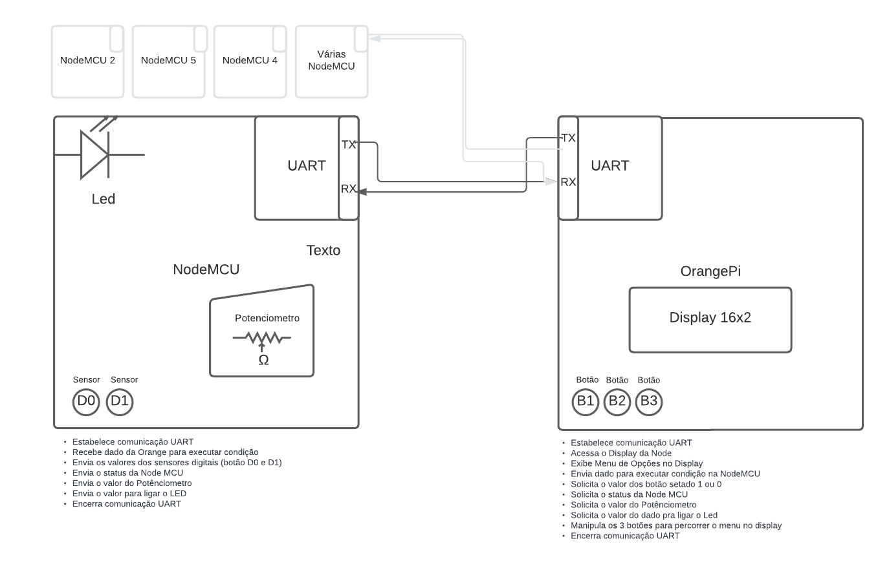
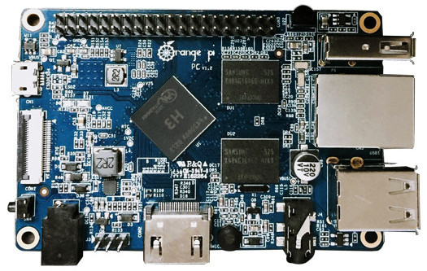
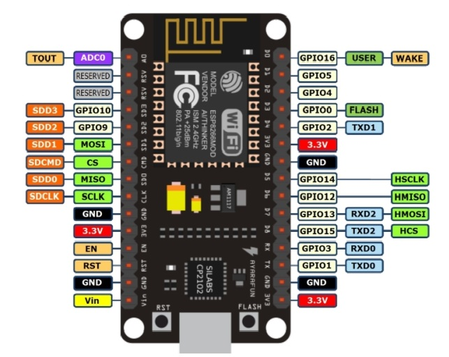
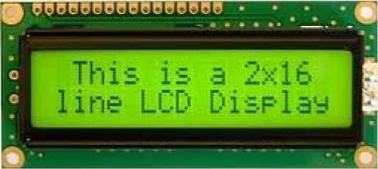

# Problema #2 – Interfaces de E/S


 📌 PBL 2 | Sistemas Digitais | Univerdade Estadual de Feira de Santana 

## 🚀 introdução

Foi solicitado um projeto de sensor analógico/digital em microcontrolador utilizando comunicação serial UART.

Consulte **[Implantação](#-implanta%C3%A7%C3%A3o)** para saber como implantar o projeto.

### 📋 Requisitos
O sistema a ser implementado no SBC deverá atender aos seguintes requisitos:
```
- O código deverá ser escrito em linguagem C; 
- Capacidade de interligação com até 32 unidades de sensoriamento;
- Mecanismo de controle de status de funcionamento das unidades;
- Apenas o SBC será capaz de iniciar uma comunicação.
```
O protótipo a ser implementado na NodeMCU deverá atender às seguintes restrições:
```
- O código deverá ser escrito em linguagem C;
- Deverá ser capaz de ler e interpretar comandos oriundos do SBC.
```
Além disso:
```
- Os comandos serão compostos por palavras de 8 bits;
- A informação medida deve ter a maior precisão possível;
- As requisições do SBC podem ser direcionadas para uma unidade específica ou a todas;
- As solicitações e as respostas deverão ser exibidas no display LCD.

```
### 📋 Recursos Utilizados

[Solicitação do Projeto](https://github.com/Dermeval/Interfaces_NodeMCU_OrangiPi_Display16x2_PBL2_SD/blob/main/Recursos/Solicita%C3%A7%C3%A3o%20do%20Projeto%20Probl2.pdf "Solicitação do Projeto")
[DataSheet do Orangi Pi PC Plus](https://github.com/Dermeval/Interfaces_NodeMCU_OrangiPi_Display16x2_PBL2_SD/blob/main/Recursos/DataSheet%20do%20ORANGE%20PI.pdf "DataSheet do Orangi Pi PC Plus")
[DataSheet do LCD](https://github.com/Dermeval/Interfaces_NodeMCU_OrangiPi_Display16x2_PBL2_SD/blob/main/Recursos/DataSheet%20do%20LCD.pdf "DataSheet do LCD")
[DataSheet do NodeMCU Esp8266EX](https://github.com/Dermeval/Interfaces_NodeMCU_OrangiPi_Display16x2_PBL2_SD/blob/main/Recursos/DataSheet%20Esp8266EX%20Node%20MCU.pdf "DataSheet do NodeMCU")

### 🔧 Perifêricos Necessários
```
1 Protoboard
1 Placa Orange Pi PC PLUS:
	1 Display LCD 16x2
	3 Botões
1 Placa NodeMCU
	2 Sensores (Botões)
	1 Led
	1 Potênciometro
1 Jumper para ligar a GPIO na Protoboard
```
### 🔧 Instalação

É necessário ter a [biblioteca WiringPi](http://wiringpi.com/download-and-install/ "biblioteca WiringiPi") devidamente instalada na sua Orange Pi
Foi utilizada a [IDE Sublime txt](https://www.sublimetext.com/3 "IDE Sublime txt") para programar a OrangePi PC Plus
Foi utilizada a [IDE Arduíno](https://www.arduino.cc/en/software "IDE Arduíno") para programar a Node MCU

## ⚙️ Metodologia

O código foi desenvolvido na** linguagem C** e permite a placa** Orange Pi** se comunicar através de uma comunicação serial **UART** com a placa **Node MCU**, onde é possível que a nossa SBC **Orange Pi** solicite para a **Node** o envio de dados do dois sensores digitais e um dado analógico medido por um potênciometro e exibir no **display 16x2** da **Orange** todas as informações, organizadas por um menu, além de também poder ligar o **LED da Node**.



Para entender melhor a relação entre as entidades, foi desenvolvido o seguinte diagrama:

## 📄 Comunicação UART

## 📄 SBC - Orange Pi PC Plus



A **Orange Pi PC Plus** é uma placa de computador de placa única (SBC) desenvolvida pela Xunlong Software, baseada na arquitetura ARM. Ela é projetada como uma alternativa de baixo custo para outras placas populares, como a Raspberry Pi.

A Orange Pi PC Plus possui um processador quad-core Allwinner H3, com núcleos Cortex-A7, operando a uma frequência de até 1,6 GHz.

## 📄 NodeMCU ESP8266EX



O **NodeMCU ESP8266EX**[[1]][Node] é uma placa de desenvolvimento baseada no chip ESP8266EX da Espressif Systems. Ele oferece conectividade Wi-Fi e tem um microcontrolador integrado que pode ser programado usando a linguagem Lua, por exemplo. É uma escolha popular para projetos de IoT e automação residencial.

## 📄 Display LCD 16X2



O **Display LCD 16x2** é um dispositivo de saída muito comum e amplamente utilizado em projetos eletrônicos. Ele consiste em uma matriz de **16** colunas e **2** linhas de caracteres alfanuméricos, permitindo a exibição de até 32 caracteres.

A comunicação com o display LCD 16x2 é geralmente feita por meio de um protocolo de comunicação de 4 ou 8 bits. No nosso caso estamos usando protocolo de comunicação de 4 bits. 

| Nome  | Pino | Descrição  |
| ------------ | ------------ | ------------ |
|  LCD_RS  |  13  |  Pino de seleção de registro |
|  LCD_E | 18  | Pino de habilitação  |
|  LCD_D4 | 21  | Pino de dados 4  |
|  LCD_D5 | 24  | Pino de dados 5  |
|  LCD_D6 | 26  | Pino de dados 6 |
| LCD_D7  | 27  | Pino de dados 7  |

Os pinos de controle do display são usados para enviar comandos e dados, como posicionar o cursor, limpar o display, definir o modo de exibição, entre outros. 

A biblioteca fornece funções convenientes para enviar comandos e dados para o display, facilitando a exibição de informações.


## ⚙️ Executando os testes
Foram feitos vários testes para saber se o nosso projeto estava de fato funcionando corretamente. No momento em que as informações não apareciam adaquedamente no menu do display, foi usado exibição no console para checar as saídas do programa.
A parte que mais reteve tempo foi a do submenus devido a alguns pequenos erros de lógica que não exibia os subMenus.
Após tirar os submenus do Switch Case e colocar direto dentro da função que a chamava.


### 🔩 Melhorias

Nosso projeto não foi totalmente concluído, da forma em que está hoje, ele não se comunica com as 32 NodeMCU como solicitado, apenas com uma.

O menu também pode melhorar mais, colocando todos os menus e submenus em switch Case para otimizar mais 

```
Dar exemplos
```

### ⌨️ 

```
Dar exemplos
```

## 📦 Implantação

Para executar o progrmama é preciso ter acesso a um terminal e acessar a Orange Pi PC Plus. Uma vez acessadda, você cria um diretório na placa, cria um código usando o comando "nano main.c" e salve na placa. Para compilar seu código, use o seguinte comando:

gcc -o main main.c -lwiringPi -lcrypt -lm -lwiringPiDev

Dessa forma ele reconhece as bibliotecas inseridas e compila o programa em C. Depois disso é só digitar sudo ./main para rodar o código.
Vale lembrar que para você executar um programa na Orange Pi. você precisa carregar antes o código presente na Node MCU e só depois executar na Orange Pi. 

## 🛠️ Construído com

Essas são as bibliotecas usadas no projeto
|  Biblioteca  |  Descrição |  Exempo de argumentos |
| ------------ | ------------ | ------------ |
|  <wiringPi.h> | Biblioteca para manipular a GPIO  |   |
| <lcd.h>  | Biblioteca para controlar o display LCD. |   |
| <stdio.h>  |  Biblioteca padrão de entrada e saída. |   |
|  <errno.h> | Biblioteca para tratamento de erros  |   |
|  <string.h> |  Biblioteca para manipulação de strings. |   |

## Resultados


## 🖇️ Colaborando

## ✒️ Autor

[Dermeval Neves](https://github.com/Dermeval "Dermeval Neves")
Engenharia de Computação

## ✒️ Tutor

[Prof. Anfranserai Morais Dias](http://buscatextual.cnpq.br/buscatextual/visualizacv.do;jsessionid=A644092F46F8A7D1B3E803E86F0DADFB.buscatextual_0 "Prof. Anfranserai Morais Dias")


## 📄 Referências:
